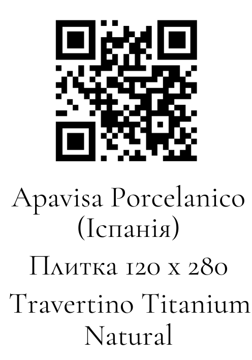

# QR Card Generator

Python automation tool for generating QR/product design cards from input data, QR codes, fonts, and visual assets.

## Example Output

Below is an example of a generated QR/product card:

> Note: The QR code in the example image is generated for demo purposes only.  
> It does not contain real client or company data.



## Overview

This project automates a repetitive design workflow: creating many product/QR cards manually.

Instead of placing text, QR codes, and design elements one by one, the script generates ready-to-use cards automatically.

The project was built as a real work automation tool, not as a tutorial exercise.

## Problem

The original workflow required manually creating many design cards, checking product names, placing QR codes, exporting files, and preparing final PDF outputs.

This process was repetitive, slow, and easy to break with small human mistakes.

## Solution

The script automates the card generation pipeline:

- reads product/card data;
- processes QR codes;
- renders design cards;
- places text and visual elements on a card layout;
- exports generated cards;
- prepares PDF output files;
- writes a processing log for easier debugging and result checking.

## Result

The tool reduces repetitive manual design work from hours to minutes.

## Tech Stack

- Python
- Pillow
- OpenCV
- ReportLab / PDF export tools
- File system automation
- Image processing

## Main Features

- Batch generation of QR/product cards
- Automatic QR code processing
- Product data parsing
- Card rendering with custom layout
- PDF export
- CSV processing log
- Fallback handling when QR/product parsing fails
- Separated modules for rendering, parsing, QR reading, PDF export, and configuration

## Project Structure

```text
qr-card-generator/
├── main.py
├── config.py
├── card_renderer.py
├── pdf_exporter.py
├── product_parser.py
├── qr_reader.py
├── requirements.txt
├── input/
├── output/
├── fonts/
└── examples/


[def]: examples/example_output.png
